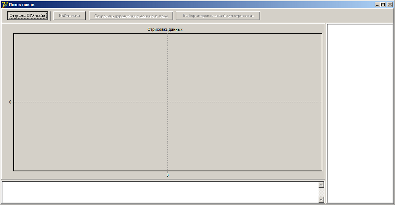
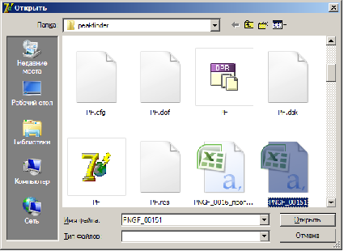
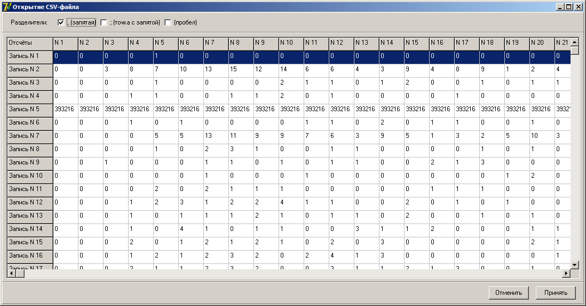
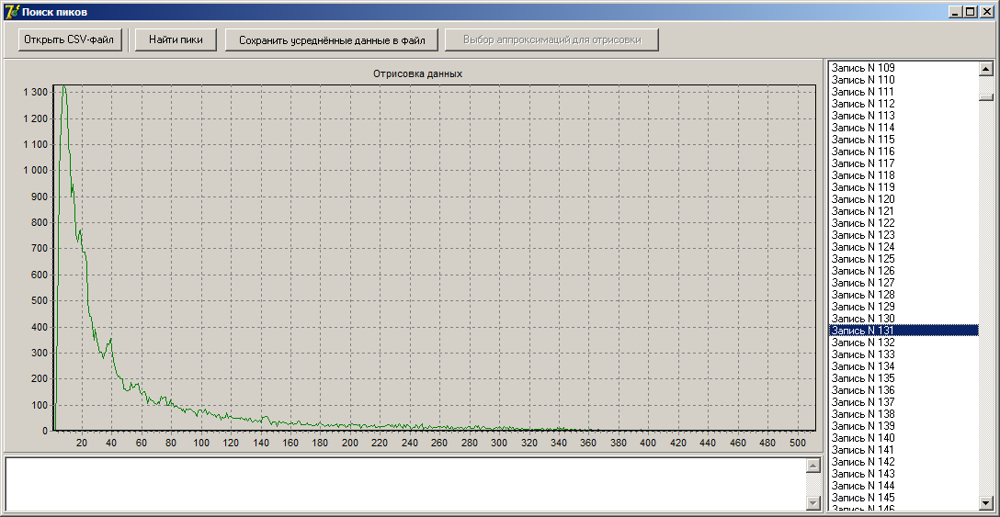
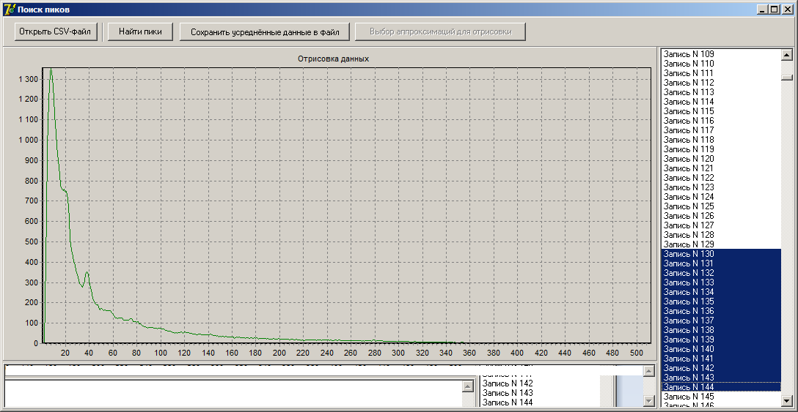
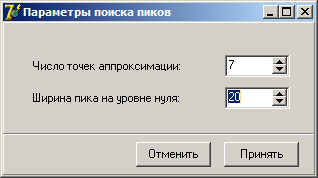
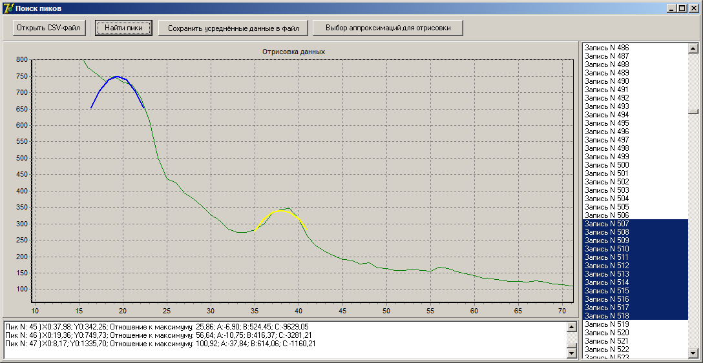
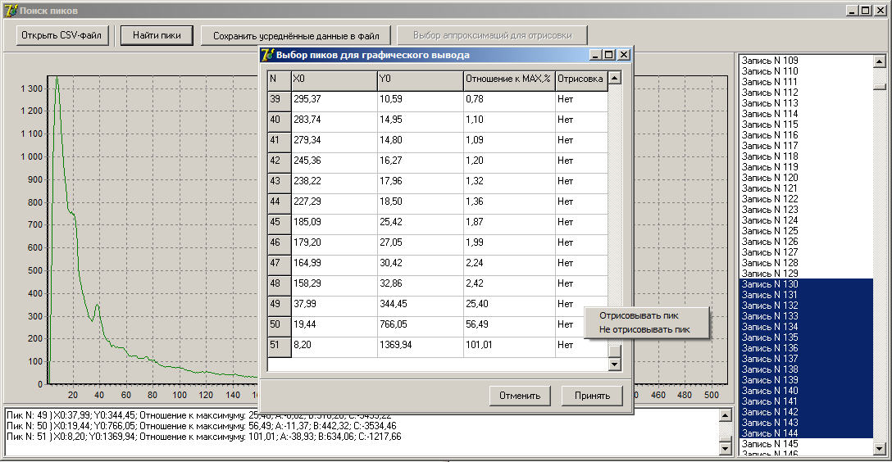
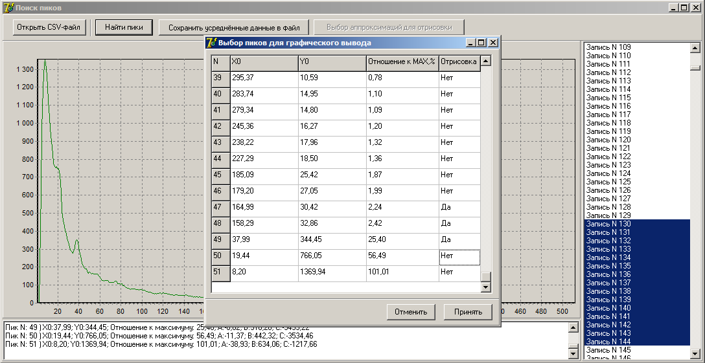
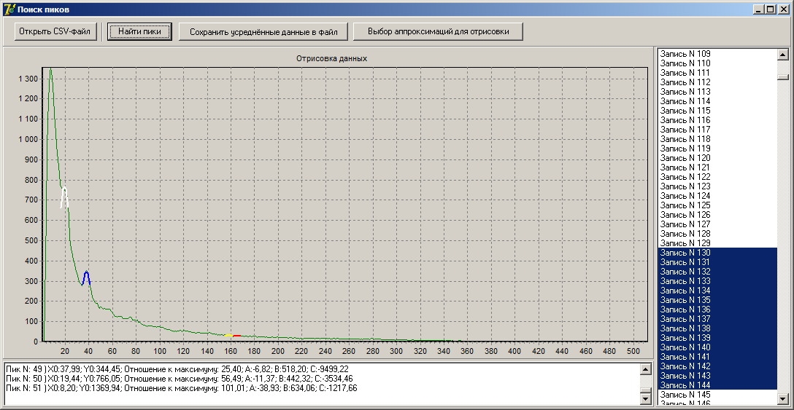

**Программа поиска пиков**

**Описание**

Данная программа позволяет находить параметры пиков (координаты вершины,  отношение высоты пика к максимальному значению спектра).  Изначально предназначалась для поиска параметров пиков в энергетических спектрах взаимодействия гамма-излучения с веществом. На данный момент, функционал программы расширен для удобства пользования.  

Поиск пиков осуществляется путем аппроксимации методом наименьших квадратов и фильтрацией по ширине пика на уровне нулевой отметки. 

**Порядок работы**

1.Данные загружаются из CSV-файлов, в которых каждая строка представляет собой спектр единичного измерения, а столбец - измеренное значение в соответствующем канале и визуализируются в графическом виде. В репозитории для примера представлены CSV-файлы с 512 канальными спектрами. 

2.Данные из различных измерений по необходимости могут усредняться.

3.Указываются параметры поиска пиков и производится расчёт аппроксимаций.

4.Найденные параметры выводятся в текстовом виде.

5.Указываются найденные аппроксимации для вывода в графическом виде. (В графе "Отрисовка" либо двойным щелчком, либо через всплывающее меню)

6.Найденные аппроксимации визуализируются в графическом виде.(Графики можно масштабировать)

